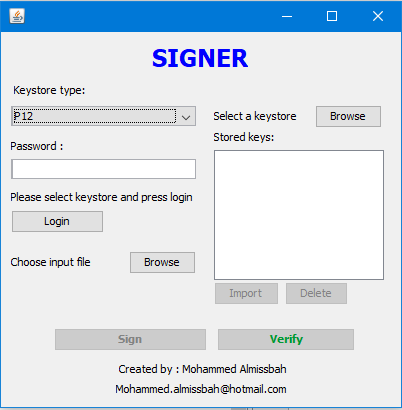

# Java PKI Tutorial
This a simple Application for testing.

## Screens :
 

## Features
1. Support for some PKCS11 and PKCS12 keystores.
2. Importing certificates.
3. Deleting keys and certificates.
4. Sign and verify signature for files.

## Supported keystores
1. *.P12 keystores.
2. ST3 crypto token.
3. Bit4id crypto token.

### The app includes the following main components:

* A local database that servers as a single source of truth for data presented to the user.
* A web api service.
* A repository that works with the database and the api service, providing a unified data interface.
* A ViewModel that provides data specific for the UI.
* The UI, which shows a visual representation of the data in the ViewModel.
* Unit Test cases for API service, Database, Repository and ViewModel.

### App Packages:
* **crypto** - contains :
  * CrytoOperations class - for encryption, decryption, hash and digital signature.
  * KeyGenerator class - for generateing symmetric and asymmetric keys.
  * **cert** - contains class for loading certificates and displaying its content.
  * **keystore** - contains classes needed to interact with soft and hardware keystores.
  * **util** - contains utils needed for reading files, certificates and keystores from hard drive.

------
## App link
